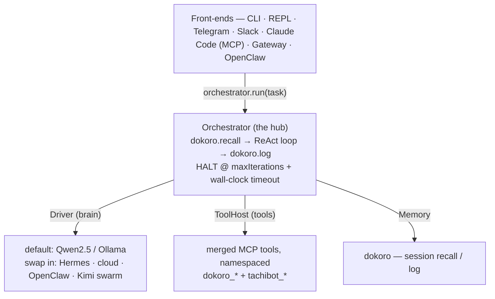

# tachi-agent

**tachi-agent — local-first agent runtime.** Dokoro gives it memory. TachiBot gives it better judgment. (TachiBot orchestrates models; tachi-agent orchestrates work.)

A **local-first orchestration agent** — a small, pluggable ReAct hub that fuses
**dokoro** (persistent memory) with **tachibot** (multi-model council) over MCP.
Its default brain runs **100% local** (Qwen2.5 via Ollama), so multi-model
reasoning runs entirely offline with no external API costs.

The agent loop lives in the **client**, never inside an MCP server — keeping the
hub small, embeddable, and free of nested-loop coupling.

📖 **Docs:** **[bypawel.github.io/tachi-agent](https://bypawel.github.io/tachi-agent/)** · built on [dokoro](https://github.com/byPawel/dokoro) (memory) + [tachibot](https://tachibot.com) (council).

## Stack

```
Frontends (CLI · REPL · Telegram · Slack · Gateway · Claude Code)
        │
        ▼
tachi-agent  ──  ReAct loop · task queue · daemon · swarm
        │                │
        ▼                ▼
    Dokoro           TachiBot
   (memory)    (council / reasoning)
```

Dokoro ←→ tachi-agent ←→ TachiBot: memory, runtime, and reasoning as three composable layers.

## Architecture



### The seams (the complete API — see `src/types.ts`)

| Seam | Swap it to… | Default |
|---|---|---|
| **`Driver`** | change the brain via `registerDriver` — Hermes (OpenAI-compatible), a cloud model, OpenClaw, a Kimi swarm | local **Qwen2.5 / Ollama** |
| **`ToolHost`** | add or remove MCP servers and tools (config, not code) | **dokoro** + **tachibot** merged, namespaced `${server}_${tool}` |
| **`Memory`** | swap or disable persistent context | **dokoro** session recall / log |

### Memory in the loop (opt-in)

By default memory is a **bookend** — `recall` before the loop, `log` after. Set
**`memoryInLoop: true`** in `OrchestratorOptions` and the loop also refreshes recall
each iteration (kept in one in-place "live memory" block, no context bloat) and writes
a per-step working-memory note via `Memory.note` → dokoro `shared_note_append` (the
append-only, agent-tagged blackboard). Off by default — it adds per-step tool calls
that a small local model handles poorly — but valuable for long, multi-step tasks.
Existing callers are unaffected.

Because the core depends only on these interfaces, every integration composes the
same hub without modifying it:

- **Tools auto-appear** from whatever MCP servers are connected — `tachibot_jury`,
  `tachibot_council`, `tachibot_grok_search`, `tachibot_perplexity_ask`,
  `tachibot_nextThought`, `tachibot_execute_prompt_technique`, `tachibot_workflow`,
  `dokoro_session_recall`, and so on — all config, not code.
- **Front-ends** (CLI, REPL, Telegram, Slack, Claude Code via an MCP `run_agent`
  tool, the HTTP/SSE Gateway, OpenClaw) just call `orchestrator.run(task)` — or,
  against a running daemon, attach via a `UnifiedClient` with the identical surface.
- **Swarm** (L3) composes the unit without changing it: N role-specialized agents
  run in parallel on the same task, then a synthesizer agent merges their answers
  (it may call `tachibot_council` / `tachibot_jury` to adjudicate). See [Swarm](#swarm).

## Roadmap

- **L0 — core** ✅ `Orchestrator` + seams + tests. Brain, tools, and memory are all mocked in tests; no network needed.
- **L1 — adapters** ✅ `OllamaDriver` (Qwen2.5, native `/api/chat`) and `HermesDriver` (OpenAI-compatible), both via a `registerDriver` registry; `McpToolHost` (dokoro + tachibot over stdio, namespaced); `DokoroMemory`; a `cli` front-end.
- **L2 — front-ends** ✅ CLI, REPL, Telegram, Slack (Socket Mode), Claude Code via a thin `run_agent` MCP server, an HTTP/SSE **Gateway**, and the **OpenClaw bridge**.
- **L2.5 — daemon** ✅ Long-running daemon (reuses the gateway) with thin-client **attach** and **session handoff** — durable monotonic event sequence, `Last-Event-ID` buffered replay, refcount-aware TTL/GC, and graceful drain. A `UnifiedClient` makes local and daemon execution interchangeable, so every front-end swaps a single constructor with no behavior change.
- **L3 — swarm** ✅ Fan out N role-specialized agents (varied prompts/drivers) in parallel on one task, then synthesize via a dedicated synthesizer agent (which can call `tachibot_council` / `tachibot_jury`). Bounded concurrency, quorum warnings, and per-member isolated dokoro sessions. See [Swarm](#swarm).
- **L4 — standalone** ✅ Persistent task queue + worker, recurring schedules, per-task multi-heart drivers (`TACHI_DRIVER` with `ollama`/`hermes`/`openai`/`openrouter`), proactive Telegram/Slack notifications, durable per-run event logs, and CLI visibility subcommands. See [Standalone mode](#standalone-mode--unattended-operation).
- **L5 — hermes-parity chat** ✅ Interactive chat by default (bare `tachi-agent` opens the REPL), unified `/commands` surface shared across REPL and Telegram, `--driver`/`--skill` flags, skill bundles (`.tachi/skills/*.md`), and `tachi-agent service install` for macOS launchd autostart.

## Develop

```bash
npm install
npm test       # vitest — core orchestrator, fully mocked
npm run build  # tsc → dist/
```

## Run

```bash
# 1. local brain
ollama serve &           # start Ollama
ollama pull qwen2.5      # recommended local tool-calling model

# 2. point at your MCP servers (council + memory)
export TACHIBOT_CMD="npx -y tachibot-mcp"
export DOKORO_CMD="npx -y @devlog-mcp/core"   # optional; omit to run tachibot-only

# 3. build + run
npm install && npm run build
tachi-agent                         # interactive chat (new in v0.4.0)
tachi-agent "verify HEAD against ADR-1..3"   # one-shot task
# dev mode:  npm run dev -- "your task"
```

### Golden demo — all three layers in two commands

```bash
# 1. run a task that exercises memory → reasoning → runtime
tachi-agent "review this repo, find one risky architectural issue, verify it with the council, remember the decision"

# 2. next session: the agent recalls what you decided
tachi-agent "what did we decide last time about that architecture risk?"
```

The first command exercises all three layers: dokoro recalls prior context (memory), tachibot_jury adjudicates the finding (reasoning), and the ReAct loop drives the whole flow (runtime). The second command confirms the decision persists across sessions.

Ctrl-C stops the run cleanly (`AbortSignal` → halts with `aborted`). Progress streams to **stderr**; the final answer prints to **stdout**.

### Install the `tachi-agent` command

```bash
# from this repo (no registry needed)
npm install && npm run build && npm link

tachi-agent                            # open interactive chat (default, no args)
tachi-agent "verify HEAD against ADR-1..3"   # one-shot task
tachi-agent --driver openai            # chat with the OpenAI heart
tachi-agent --skill researcher         # chat with the researcher skill active
tachi-agent task list                  # queue visibility (needs TACHI_DAEMON_URL + GATEWAY_TOKEN)
tachi-agent runs log <run-id>          # inspect a run's durable event log
```

`npm link` (or, once published, `npm i -g tachi-agent`) puts all eight binaries on your PATH: `tachi-agent`, `tachi-agent-daemon`, `tachi-agent-mcp`, `tachi-agent-gateway`, `tachi-agent-telegram`, `tachi-agent-slack`, `tachi-agent-repl`, `tachi-agent-swarm`.

## Interactive chat (v0.4.0)

Bare `tachi-agent` (no arguments) opens an interactive REPL session. Pass `--driver <name>` or `--skill <name>` to start with a specific heart or skill bundle active.

```bash
tachi-agent                            # opens: tachi ›
tachi-agent --driver openai            # opens: tachi [openai] ›
tachi-agent --skill researcher         # opens: tachi [researcher] ›
```

The prompt shows the active session: `tachi [driver·skill] ›`. History persists at `~/.tachi-agent/repl_history` (capped at 1000 lines). Rewritten tasks (from `/jury`, `/search`, `/think`) are echoed as `→ task` before running.

### Commands (unified across REPL and Telegram)

| Command | What it does |
|---|---|
| `/help` | Show the command list |
| `/tools` | List the agent's available tools |
| `/model` | Show the current model |
| `/status` | Show session state (driver, skill, mode) |
| `/driver <name>\|off` | Set or clear the session driver |
| `/skill <name>\|off` | Activate or clear a skill bundle |
| `/reset` | Clear the full session (driver + skill) |
| `/jury <question>` | Run a cross-model jury verdict via `tachibot_jury` |
| `/search <query>` | Search with `tachibot_grok_search` or Perplexity |
| `/think <question>` | Reason step by step over a question |
| `/task add <text>` | Queue a task on the daemon |
| `/task list` | List queued tasks |
| `/task show <id>` | Show task detail |
| `/schedule list` | List scheduled jobs |
| `/exit`, `/quit` | Leave (REPL: Ctrl-D also exits) |

Driver precedence: `--driver` flag (or `/driver` command) > skill's `driver` field > `TACHI_DRIVER` env var.

## Skills (recipes)

Skills are markdown files in `.tachi/skills/*.md` (override with `TACHI_SKILLS_DIR`). Each skill narrows what a run sees: its body is appended to the system prompt, `tools` restricts the tool surface (fail-closed), and `driver` suggests a heart.

**Frontmatter format** (exactly as parsed by `src/skills.ts`):

```markdown
---
name: researcher
description: Deep-research mode — searches and synthesizes a cited report.
tools: tachibot_grok_search, tachibot_perplexity_ask, tachibot_nextThought
driver: openai
---
You are a careful research assistant. Your output must be accurate and traceable.
...
```

**Precedence rule:** `/driver` command (or `--driver` flag) > skill's `driver` field > `TACHI_DRIVER`.

Activate a skill:
```bash
tachi-agent --skill researcher "explain the CAP theorem trade-offs"
# or in the REPL:
# /skill researcher
```

**Example recipes** are in [`examples/skills/`](examples/skills/):
- `repo-review.md` — jury + Grok code analysis + dokoro decision record
- `researcher.md` — search tools + cited-report prompt
- `nightly-digest.md` — search + jury; driver: openai
- `fact-checker.md` — Perplexity fact-check protocol

Copy them into your project's `.tachi/skills/` directory (or point `TACHI_SKILLS_DIR` at `examples/skills/` to use them as-is).

## Swarm

The **swarm** (L3) fans out **N role-specialized agents on the same task**, runs them in
parallel, then a **synthesizer** agent merges their answers into one. Each member is the
same `Orchestrator` unit with a different *role lens* (system prompt) and, optionally, a
different driver — so you get diverse perspectives, not N identical runs.

```bash
# default roles: implementer · critic · researcher
npm run swarm -- "design a rate limiter for the gateway"

# or the built bin directly
node dist/frontends/swarm.js "design a rate limiter for the gateway"
```

Configure the roster with `TACHI_SWARM_ROLES` (comma-separated; `name` or `name:driver`;
empty = the defaults):

```bash
# custom roles, one running on the Hermes driver
export TACHI_SWARM_ROLES="implementer,critic:hermes,security,researcher"
npm run swarm -- "review this auth flow"
```

How it behaves:

- **Parallel, bounded.** Members run concurrently with a small concurrency cap (default 4),
  so large rosters don't fan out unbounded. Each member inherits the orchestrator's
  `maxIterations` / `timeoutMs` / cost tracking.
- **Failure-tolerant + quorum.** A member that errors or times out is recorded with an empty
  answer and excluded from synthesis; the swarm still proceeds. If too few members answer (or
  a `critical` role — e.g. the critic — produces nothing), it surfaces a non-fatal **warning**
  rather than failing.
- **Synthesis.** A separate synthesizer agent runs over the members' labeled answers and
  returns one merged result; if the council tools are present it uses `tachibot_council` /
  `tachibot_jury` to adjudicate disagreements.
- **Memory.** Each run gets a unique `traceId`. Members are **independent**: each writes to its
  own isolated dokoro session (`swarm:<traceId>:<role>`) and never reads peers' or prior runs'
  memory — preserving distinct perspectives. The final synthesized answer is logged **once**
  under `swarm:<traceId>` for a clean, race-free trace.

Progress streams to **stderr** (one line per member, any warnings, and the trace id); the
final synthesized answer prints to **stdout**.

```ts
import { buildSwarmFromEnv } from "tachi-agent";

const swarm = await buildSwarmFromEnv();
try {
  const { answer, members, warnings } = await swarm.run("design a rate limiter");
  console.log(answer);
} finally {
  await swarm.close();
}
```

## Security

- **Local-first is the security posture.** The default brain is local Qwen2.5 (Ollama bound to `127.0.0.1`, no SSRF) and tools run over local stdio. tachi-agent holds **no cloud keys** — the council's provider keys live in `tachibot-mcp`, so the agent's own secret surface is near zero.
- **Trust boundary.** MCP server commands come only from config/env (`*_CMD`), never from a user or model message — no command injection. The `McpToolHost({ allow })` allowlist keeps write or dangerous tools out unless explicitly granted.
- **Untrusted front-ends (Telegram / Slack / HTTP).** Authenticate at the edge (Telegram allowed user-ids, Slack app tokens, localhost-only MCP). The task string is *data*; the agent can only call allowlisted tools, never arbitrary shell.
- **Prompt injection.** Search and tool results fed back may carry injection. Mitigate with a bounded tool allowlist (no shell or file-write by default), by treating tool output as untrusted data, and with approval gates for any write tool (roadmap).

## Multi-tenant

- **One `Orchestrator`, one `AbortController`, and one dokoro session/workspace id per tenant.** The orchestrator is stateless between runs, so N tenants = N independent `run()` calls with no shared state.
- Don't share memory across tenants — scope dokoro recall/log by tenant session id. Use per-tenant tool allowlists and per-tenant `maxIterations` / `timeoutMs` as rate and cost limits.

## Deploy

- **Default: local CLI** — most private, zero infra, fully on-device.
- **Gateway.** Wrap `orchestrator.run` behind a thin service — either a `run_agent` MCP server (Claude Code connects in) or the HTTP/SSE gateway (Telegram/Slack webhooks). Put **auth, rate-limiting, and a per-tenant allowlist** in front. Keep the model local even when the gateway is hosted — host only the thin orchestrator, not the brain, so the privacy story holds. Any cloud secrets stay in `tachibot-mcp`.

## Gateway API

```bash
export GATEWAY_TOKEN="change-me" GATEWAY_PORT=8787
export TACHIBOT_CMD="npx -y tachibot-mcp"
npm run build && node dist/frontends/gateway.js
```

| Method & path | Purpose |
|---|---|
| `POST /runs` `{task, maxIterations?, driver?, systemPrompt?, allowTools?}` | start a run → `202 {run_id}` |
| `GET /runs/:id` | run state + final result |
| `GET /runs/:id/events` | **SSE** stream: `step` / `assistant` / `tool-result` / `final` / `error` / `heartbeat` |
| `DELETE /runs/:id` | cancel (cooperative abort) |

All requests require `Authorization: Bearer <token>`; run ids are namespaced per tenant. The async-job + SSE shape is resilient to disconnects, with resumable replay via `Last-Event-ID`. Keep the model local even when the gateway is hosted, and put rate-limits and quotas at this boundary.

### OpenClaw bridge

Let [OpenClaw](https://github.com/openclaw) delegate tasks to tachi-agent over the gateway HTTP/SSE API. Run `npm run gateway` (with `GATEWAY_TOKEN`), then from OpenClaw:

```ts
import { GatewayClient } from "tachi-agent";

const tachi = new GatewayClient({
  baseUrl: "http://127.0.0.1:8787",
  token: process.env.TACHI_GATEWAY_TOKEN!,
});
const answer = await tachi.runAndWait("research X");
```

See [docs/openclaw-bridge.md](docs/openclaw-bridge.md) for plugin/skill wiring.

## Standalone mode — unattended operation

The daemon is the standalone foundation: a persistent task queue, a worker that drains it,
recurring schedules, per-task driver selection, outcome notifications, and a durable per-run
event log. Run it under a process supervisor and it operates with nobody attached.

### Run the daemon under a supervisor

**macOS (launchd) — the primary path:**

```bash
export GATEWAY_TOKEN="change-me"
tachi-agent service install --env-file .env
# starts at login, restarts on crash
# logs: ~/Library/Logs/tachi-agent/daemon.log
tachi-agent service status
tachi-agent service uninstall
```

`service install` reads `GATEWAY_TOKEN` + all `TACHI_*` vars from the environment (or from
`--env-file <path>`), writes a `0600` plist under `~/Library/LaunchAgents`, and bootstraps
the service with `launchctl`. The `--cwd <dir>` flag sets the working directory (default
`~/.tachi-agent`).

**Linux (systemd):**

Run `node dist/daemon/index.js` under a systemd unit with `Restart=always`:

```ini
[Unit]
Description=tachi-agent daemon
After=network.target

[Service]
ExecStart=/usr/bin/node /path/to/dist/daemon/index.js
WorkingDirectory=/path/to/.tachi-agent
EnvironmentFile=/path/to/.env
Restart=always
RestartSec=5

[Install]
WantedBy=multi-user.target
```

### Queue work from outside (external cron)

`POST /tasks` enqueues durable work — unlike `POST /runs`, a queued task survives restarts and
retries with exponential backoff (default 3 attempts). External cron is the scheduler of record
for anything calendar-driven you want outside the agent:

```cron
# crontab — nightly digest at 02:30, run on the OpenAI heart
30 2 * * * curl -s -X POST -H "Authorization: Bearer $TACHI_TOKEN" -H "Content-Type: application/json" \
  -d '{"task":"summarize yesterdays inbox and post to slack","driver":"openai"}' http://127.0.0.1:8787/tasks
```

### Recurring schedules (built in)

For self-contained recurrence, the daemon also evaluates `.tachi/schedules.json`
(`TACHI_SCHEDULES_FILE`) every `TACHI_SCHEDULES_POLL_MS` (default 30s) and enqueues due
entries into the same queue:

```json
{
  "schedules": [
    { "id": "morning-digest", "task": "compile the morning digest", "driver": "openai", "kind": "daily", "at": "07:00" },
    { "id": "poll", "task": "check the feed for updates", "kind": "every", "everyMinutes": 30 }
  ]
}
```

- `kind: "daily"` + `at: "HH:MM"` — fires once per day, the first tick at/after that local time.
- `kind: "every"` + `everyMinutes: N` — fires immediately on first sight, then every N minutes.
- The file is **yours**: it's re-read on every tick, so hand edits apply without a restart, and
  the daemon never writes to it. Machine state (last-run times) lives in a separate
  `.tachi/schedules-state.json`, so a restart doesn't re-fire a schedule that already ran.
- Malformed entries are skipped with a stderr warning; a broken file never takes the daemon down.

### Multi-heart: per-task drivers

`TACHI_DRIVER` picks the daemon's default brain (`ollama` by default — local, private). A task's
optional `"driver"` field overrides it **for that task only**: keep the local heart for
interactive chat, and send a nightly heavy job to `"driver": "openai"` or `"openrouter"`.

Selection is **explicit by design** — there is no automatic routing and no silent fallback. A
task naming an unknown or unconfigured driver (e.g. `openai` without `OPENAI_API_KEY`) fails
loudly: the actionable error is recorded on the task, normal retry/backoff applies, and the
failed task stays inspectable in the queue.

### Notifications

Set `TACHI_NOTIFY` (e.g. `telegram:123456789,slack:C0123ABC`) and the worker pushes every task
outcome — success or failure — to those targets, using the existing `TELEGRAM_BOT_TOKEN` /
`SLACK_BOT_TOKEN`. The agent reaches out; you don't poll.

### Inspecting state

| Where | What |
|---|---|
| `GET /tasks`, `GET /tasks/:id` | live queue: status, attempts, driver, answer/error |
| `.tachi/queue.json` | the queue on disk (survives restarts; readable JSON) |
| `.tachi/runs/*.jsonl` | durable per-run event log (`TACHI_RUN_LOG_DIR`) — every step, append-only |

## Extending (without forking)

```ts
import { createOrchestrator, registerDriver } from "tachi-agent";

// 1. register any brain (Hermes, a cloud model, OpenClaw, a Kimi-swarm driver)
registerDriver("hermes", () => new HermesDriver());

// 2. build the hub from a registered name (or a raw Driver instance)
const controller = new AbortController();
const result = await createOrchestrator({
  driver: "hermes",
  host,
  memory,
  options: { maxIterations: 12, timeoutMs: 90_000, signal: controller.signal },
}).run("verify HEAD against ADR-1..3");
// elsewhere: controller.abort() → run halts with haltedBy: "aborted"
```

Implement `Driver` / `ToolHost` / `Memory` (see `src/types.ts`) to extend; no core changes required.

## Configuration

All configuration is via environment variables (e.g. in `.env`, loaded with `node --env-file=.env`).

### Orchestrator
| Variable | Default | Purpose |
|---|---|---|
| `TACHI_ALLOW` | curated council/search/memory set | Comma-separated tool allowlist (exact names or `server_` prefixes). `tachibot_,dokoro_` exposes everything. |
| `TACHI_FORCE_SEARCH` | off | `1/true/yes/on` → force a grounding search before reasoning on EVERY task. |
| `TACHI_MAX_EMPTY_TURNS` | `2` | Consecutive blank model turns nudged through before halting as `empty-response`. |
| `TACHI_CALL_TIMEOUT_MS` | `120000` | Per-MCP-tool-call timeout. |
| `TACHI_MAX_TOOL_RESULT_CHARS` | `30000` | Truncate tool results before they reach the model context (`0` disables). |
| `TACHI_CONTEXT_INSPECT` | off | `1` → emit per-turn context JSONL to `.tachi/context-inspect/`. |

### Drivers
| Variable | Default | Purpose |
|---|---|---|
| `TACHI_DRIVER` | `ollama` | Default brain by registered name: `ollama` \| `hermes` \| `openai` \| `openrouter`. A queued task's `driver` field overrides per task. |
| `OLLAMA_BASE_URL` | `http://127.0.0.1:11434` | Ollama endpoint. |
| `OLLAMA_MODEL` | `qwen2.5` | Local model name. |
| `OLLAMA_NUM_CTX` | `8192` | Context window override. |
| `HERMES_BASE_URL` / `HERMES_MODEL` / `HERMES_API_KEY` | unset | Optional Hermes (OpenAI-compatible) driver. |
| `OPENAI_API_KEY` | unset | Required for the `openai` driver. |
| `OPENAI_MODEL` | `gpt-4o-mini` | OpenAI model. |
| `OPENAI_BASE_URL` | `https://api.openai.com/v1` | OpenAI-compatible endpoint (include `/v1`). |
| `OPENROUTER_API_KEY` | unset | Required for the `openrouter` driver. |
| `OPENROUTER_MODEL` | `openrouter/auto` | OpenRouter model. |
| `OPENROUTER_BASE_URL` | `https://openrouter.ai/api/v1` | OpenRouter endpoint. |

### MCP servers
| Variable | Default | Purpose |
|---|---|---|
| `DOKORO_CMD` | unset | Command line to spawn the dokoro memory MCP server. |
| `TACHIBOT_CMD` | unset | Command line to spawn the tachibot multi-model MCP server. |

### Skills
| Variable | Default | Purpose |
|---|---|---|
| `TACHI_SKILLS_DIR` | `.tachi/skills` | Directory of `*.md` skill files. Malformed files are skipped with a warning. |

### Frontends
| Variable | Default | Purpose |
|---|---|---|
| `TELEGRAM_BOT_TOKEN` / `TELEGRAM_ALLOWED_USER_IDS` | required | Bot token + comma-separated numeric allowlist (fail-closed: empty = refuse to start). |
| `SLACK_BOT_TOKEN` / `SLACK_APP_TOKEN` / `SLACK_ALLOWED_USER_IDS` | required | Bot + Socket-Mode app token + user-ID allowlist (fail-closed). |

### Gateway / daemon
| Variable | Default | Purpose |
|---|---|---|
| `GATEWAY_TOKEN` / `GATEWAY_TOKENS` | required | Bearer auth (single token, or `name:token` pairs for tenants). Daemon refuses to start without one. |
| `GATEWAY_PORT` | `8787` | Gateway listen port (`tachi-agent-gateway`). |
| `TACHI_DAEMON_URL` | unset | When set, thin clients (cli/repl/telegram/slack) attach to the daemon instead of building a local runtime. |
| `TACHI_DAEMON_PORT` | `8787` | Daemon listen port. |
| `TACHI_SESSION_TTL_MS` | `600000` | Idle TTL before an unattached finished run is GC'd. |
| `TACHI_SESSION_BUFFER_MAX` | `10000` | Per-run SSE replay ring-buffer cap. |
| `TACHI_DRAIN_TIMEOUT_MS` | `30000` | Hard upper bound on graceful-shutdown drain. |
| `TACHI_DEBUG` | off | Verbose stderr diagnostics. |

### Standalone (queue · schedules · notifications)
| Variable | Default | Purpose |
|---|---|---|
| `TACHI_QUEUE_FILE` | `.tachi/queue.json` | Persistent task-queue file (atomic writes; crash-safe). |
| `TACHI_QUEUE_POLL_MS` | `2000` | Worker poll cadence over the queue. |
| `TACHI_RUN_LOG_DIR` | `.tachi/runs` | Durable per-run JSONL event log directory. |
| `TACHI_NOTIFY` | unset | Outcome push targets: comma-separated `kind:target`, e.g. `telegram:123,slack:C0ABC`. |
| `TACHI_SCHEDULES_FILE` | `.tachi/schedules.json` | Human-edited recurring-schedule definitions (state kept separately in `…-state.json`). |
| `TACHI_SCHEDULES_POLL_MS` | `30000` | Schedule evaluation cadence. |

### Swarm
| Variable | Default | Purpose |
|---|---|---|
| `TACHI_SWARM_ROLES` | built-in roles | Override the swarm role lineup. |

## License

MIT — see [LICENSE](LICENSE). tachi-agent is a pluggable client meant to be embedded by other agents; the council's provider keys and the persistent-memory backend live behind the MCP wire (`tachibot-mcp`, `dokoro`), so an MIT client and the server it calls compose cleanly.
